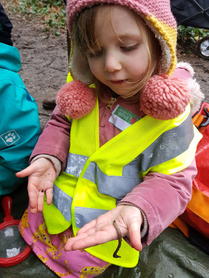

I'm Katie and I'm a Level 3 Forest School Leader. I'm a
qualified teacher, and have worked with children of all age
groups. I've also volunteered extensively with Guiding and Scouting
groups, both in the UK and Sweden. I lived in Sweden for 5 years where
I was inspired by their approach to 'friluftsliv', or outdoor
living. I subscribe to the Swedish philosophy that there's 'no such
thing as bad weather, only bad clothing!'

I hold a Forest School First Aid certificate, am DBS cleared, and have
public liability insurance to carry out Forest School sessions. Copies
of these documents can be viewed on request.

## Projects

Here is a taste of some of our past and ongoing activities:

* Our [Little Explorers](sessions.html) forest play group in Orpington.

* Forest Fridays, a woodland exploration session at a private nursery in Bromley.

* [Forest School training courses](https://thehive-kids.com/pages/forest-school-training) with [The Hive Kids](https://thehive-kids.com/pages/concept-and-curriculum), and facilitating holiday missions for primary age children.

* [Birthday parties](https://www.kent.gov.uk/leisure-and-community/kent-country-parks/birthday-parties) and other outdoor sessions with Kent County Council.

* [Muddy Boots](https://www.facebook.com/muddybootsfs/) running monthly sessions and birthday parties. 

To contact us email [wildberrywoodlearning@gmail.com](mailto:wildberrywoodlearning@gmail.com). 

